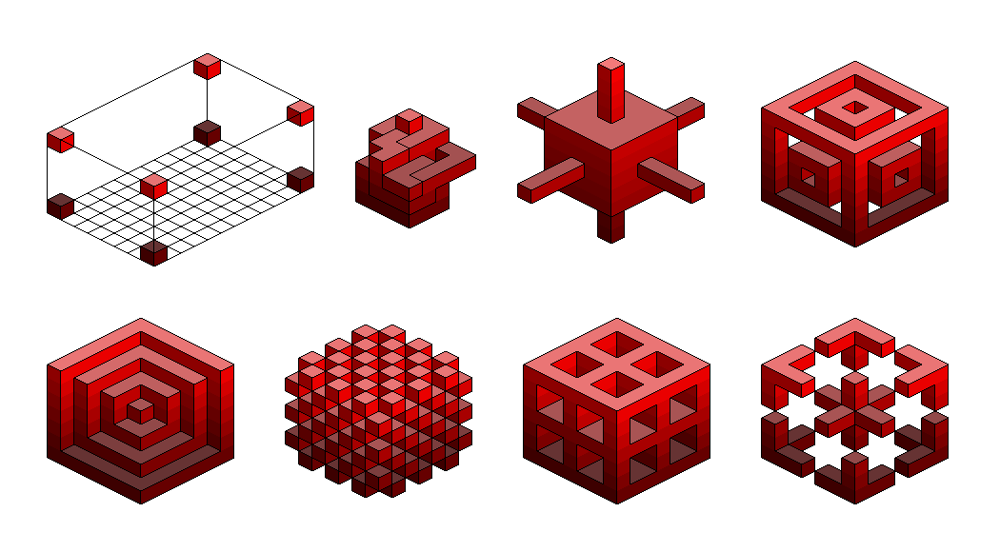

# IsoRenderer
A 2D isometric renderer in Python 3 based on PyCairo

Can be easily animated, see [gist](https://gist.github.com/nst/1cfb01d0b78993f7ffe2df7c101b586c) and [GIF](https://seriot.ch/visualization/iso7.gif)
